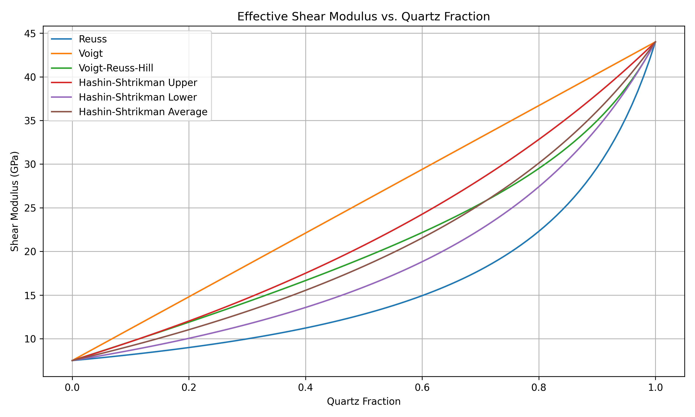

# Effective mineral properties

A volume of rock will generally consist of several minerals, each having its own elastic properties. To calculate
the overall elastic properties of the volume, we need to know the elastic properties of each mineral, the volume
fractions of the minerals, and we must have a model for how to mix the volume fractions.

Default values for the elastic properties of the most common minerals are provided in `fmu-pem`, but they should
be verified in each case. Shale is often given as the effective mineral properties of a combination of constituents,
and it can range from a soft marine clay to a stiff, quartz-rich silt.

| Mineral    | Density [kg/m^3] | Bulk modulus [GPa] | Shear modulus [GPa] |
|------------|------------------|--------------------|---------------------|
| Quartz     | 2650.0           | 36.8               | 44.0                |
| Shale      | 2680.0           | 25.0               | 12.0                |
| Calcite    | 2710.0           | 76.8               | 32.0                |
| Dolomite   | 2870.0           | 94.9               | 45.0                |
| Stevensite | 2490.0           | 32.5               | 45.0                |

<strong>Table 1:</strong> Default values of elastic properties for common minerals.

More mineral properties can be found in the **Rock Physics Handbook**.

Mavko, G., Mukerji, T., & Dvorkin, J. (2020). *The Rock Physics Handbook* (3rd ed.). Cambridge University Press.

## Volume fractions

Please make sure that the section on [volume fractions](./import-sim-results.md) is understood, and that the `YAML` file
contains information about all minerals that should be included in the PEM, and also if they are defined as volume
fractions or mineral fractions.

## Mix models for effective mineral properties

Two models for mixing minerals are available in `fmu-pem`: **Hashin-Shtrikman** and **Voigt-Reuss-Hill** average. The
difference between them is illustrated in [Figure 1](figure-1-bulk-modulus) and [Figure 2](figure-2-shear-modulus)
below. In this example, quartz is mixed with a soft marine clay in different proportions. As shown, there is negligible
difference in effective bulk modulus properties when selecting either Hashin-Shtrikman average or Voigt-Reuss-Hill average.
The upper and lower bounds of both methods are also included in the plots. The bounds for Hashin-Shtrikman are notably
narrower than for Voigt and Reuss bounds, with the latter representing the stiffest and softest theoretical combinations,
respectively.

<strong>Figure 1:</strong> Bulk modulus for a mix of quartz and marine clay.
  

<strong>Figure 2:</strong> Shear modulus for a mix of quartz and marine clay.
  
