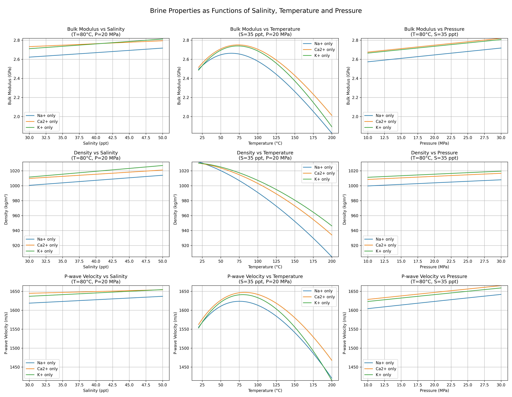
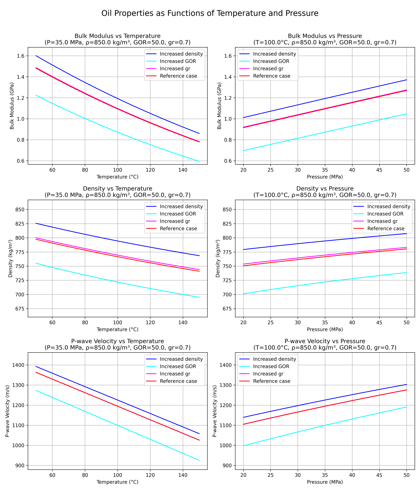
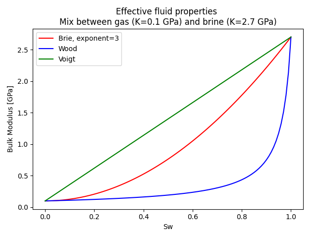

# Effective fluid properties

Similar to mineral properties, effective fluid properties are determined by the properties of each fluid phase,
saturations and a mixing model. For "normal" (Newtonian) fluids, the elastic properties are bulk modulus and density
from which compressional wave velocity (Vp) can be derived.

Unlike mineral properties, the elastic properties of each fluid phase are not constants. They vary with temperature
and pressure, as well as other parameters, listed in [Table 1](table-1-fluid-model-parameters) below. Pressure in
terms of fluid modelling is synonymous with formation pressure.

| Fluid phase | Parameters                                                    |
|-------------|---------------------------------------------------------------|
| Brine       | Salinity, percentage of NaCl, KCl, CaCl₂                     |
| Gas         | Gas gravity                                                   |
| Oil         | Gas gravity, gas/oil ratio, oil density @ standard conditions |
| Condensate  | Gas gravity, gas/oil ratio, oil density @ standard conditions |
| CO₂         |                                                               |

<span id="table-1-fluid-model-parameters"><strong>Table 1:</strong> Required parameters for fluid modelling.</span>

The fluid models used in this context are simplifications compared to more complex equation-of-state models, where
all components must be declared with their compositional fractions. For the purpose of effective fluid properties
in sedimentary rocks, the selected models suffice.

## Model selection

In the open-source version of `fmu-pem`, most fluid models are implementations of Batzle and Wang 1992. The CO₂ model is
an implementation of Span and Wagner 1996. Proprietary models may be added to the open-source ones, which is the case
at Equinor. The illustrations that are included in the documentation are produced with the Equinor internal models.

Batzle, M. and Wang, Z.: *Seismic properties of pore fluids.* Geophysics, vol. 57, No. 11, pp. 1396–1408.

Span, R. and Wagner, W.: *A New Equation of State for Carbon Dioxide Covering the Fluid Region from the Triple-Point
                        Temperature to 1100 K at Pressures up to 800 MPa.* J. Phys. Chem. Ref. Data, vol. 25, No. 6,
                        1996, pp. 1509–1596.

### Brine model

As listed in [Table 1](table-1-fluid-model-parameters), salinity and composition of different salts are required for
modelling of brine properties, in addition to pressure and temperature. Note that the brine model assumes single-phase
behaviour, i.e. it is not a model for steam, nor ice. Values for salinity and composition are taken from isotope
analysis reports. An example is shown in [Figure 1](figure-1-isotope-analysis). The values we require here are
*total dissolved solids*, *Na⁺*, *Ca²⁺* and *K⁺*. All are given here in unit **mg/L**, which is equivalent to **ppm**,
i.e., the expected unit for salinity. Calculating the percentage of Na, Ca and K should be straightforward, as they
have the same unit. Variation in composition has much less influence on the elastic properties than salinity,
temperature and pressure; see [Figure 2](figure-2-brine-properties).


<span id="figure-1-isotope-analysis"><strong>Figure 1:</strong> Result of formation water isotope analysis.</span>
<br><br>


<span id="figure-2-brine-properties"><strong>Figure 2:</strong> Brine property modelling results.</span>
<br><br>

### Gas model

The light hydrocarbon gas model has a single parameter in addition to temperature and pressure: gas gravity. Gas gravity
is defined as the molecular weight of the gas relative to the molecular weight of air. [Table 2](table-2-gas-gravity)
shows the gas gravity for alkanes from methane through octane. Modelling results are shown in [Figure 3](figure-3-gas-properties).

| **Alkane**   | **Chemical Formula** | **Molecular Weight (g/mol)** | **Gas Gravity** (G)     |
|--------------|----------------------|------------------------------|-------------------------|
| Methane      | CH₄                  | 16.04                        | 0.554                   |
| Ethane       | C₂H₆                 | 30.07                        | 1.038                   |
| Propane      | C₃H₈                 | 44.10                        | 1.522                   |
| Butane       | C₄H₁₀                | 58.12                        | 2.006                   |
| Pentane      | C₅H₁₂                | 72.15                        | 2.490                   |
| Hexane       | C₆H₁₄                | 86.18                        | 2.974                   |
| Heptane      | C₇H₁₆                | 100.20                       | 3.459                   |
| Octane       | C₈H₁₈                | 114.23                       | 3.943                   |

<span id="table-2-gas-gravity"><strong>Table 2:</strong> Gas gravity for different alkanes.</span>


<span id="figure-3-gas-properties"><strong>Figure 3:</strong> Gas property modelling results.</span>
<br><br>

### Oil and condensate models

Oil and condensate models require the same set of parameters. The density of the liquid phase at standard
conditions, the gravity of the gas phase and the volumetric gas/oil ratio are all required, in addition to temperature
and pressure. There are limitations for most of the input parameters within a valid model range; for example, gas/oil ratio must be
less than 600, otherwise the condensate model must be used.

It should also be noted that the oil model does not cover very heavy oil, such as Canadian or Venezuelan bitumen. As
these varieties of hydrocarbons are not a prime target for Equinor, we have not included such models in `fmu-pem`. Oil
with an API gravity as low as 10° can be modelled with the standard oil model, unless the temperature is very low. Oil
properties as functions of temperature and pressure are shown in [Figure 4](figure-4-oil-properties). The other
parameters are shown with one reference case, and comparison cases where each parameter is increased, one at a time.

In general, oil properties are reduced with increasing temperature and increased with increasing pressure. Increasing
GOR reduces all oil properties, gas gravity has little influence, and increasing oil density increases all oil
properties.

The oil model assumes that at reservoir conditions, all gas is dissolved in the oil. Below the bubble point, the oil
model will not estimate correct results. An Equinor internal function handles cases that are below the bubble point.


<span id="figure-4-oil-properties"><strong>Figure 4:</strong> Oil property modelling results.</span>
<br><br>

### CO₂ model

The CO₂ models require only temperature and pressure as parameters. The model of Span and Wagner should be the
default choice, although it requires more computational time than the Equinor internal alternative. CO₂ behaviour is
complex because it can exist in three different phases within normal reservoir temperature and pressure ranges:
gas, liquid and supercritical phases. [Figure 5](figure-5-co2-properties) shows the CO₂ properties with one parameter
varied at a time.

To get a full overview of the CO₂ properties, all combinations of reservoir temperature and pressure should be examined,
as shown in [Figure 6](figure-6-co2-meshgrid), and complemented by the phase diagram
in [Figure 7](figure-7-co2-phase-diagram). Most models will not provide a complete picture of the possible combinations
of hydrocarbons, brine and CO₂, as CO₂ can also react with the rock matrix and dissolve or precipitate minerals.


<span id="figure-5-co2-properties"><strong>Figure 5:</strong> CO₂ property modelling results.</span>
<br><br>


<span id="figure-6-co2-meshgrid"><strong>Figure 6:</strong> CO₂ property modelling results.</span>
<br><br>


<span id="figure-7-co2-phase-diagram"><strong>Figure 7:</strong> CO2 phase diagram, from Yang et al. 2018.</span>
<br><br>

Yang, Jianfeng & Lian, Haojie & Liang, Weiguo & Nguyen, Vinh Phu & Chen, Yuedu. (2018). Experimental investigation of
the effects of supercritical carbon dioxide on fracture toughness of bituminous coals. International Journal of Rock
Mechanics and Mining Sciences. 107. 10.1016/j.ijrmms.2018.04.033.

## Mixing models for effective fluid properties

Two models are implemented in fmu-pem for estimating the effective fluid properties: Brie and Wood. Wood's model
is similar to a Reuss lower bound, i.e. it is the softest combination of fluid phases. With Wood's model, small amounts
of gas out of solution will have a strong impact on the effective fluid bulk modulus. Wood's equation assumes that
fluid heterogeneities are small compared to the acoustic wavelength.

The alternative, Brie's model, is an empirical relation. It has one parameter (the Brie exponent) which determines
the curve shape of the mixture. A typical value is **3.0**. In a fluid mixture with more heterogeneities, Brie's model
can be closer to observations than Wood's. These can be considered realistic upper and lower bounds for fluid properties
, as it is unlikely that the mixture will approach the Voigt bound.

[Figure 8](figure-6-brine-gas-mix) illustrates mixing of brine and gas. The impact of gas is most prominent in the Wood
mixture. It has been noted that a small amount of gas in brine ("fizz gas") can have similar properties to oil, which
has led to uncertainty in evaluation of exploration prospects.


<span id="figure-8-brine-gas-mix"><strong>Figure 8:</strong> Brine and gas mixing model comparison.</span>
<br><br>

## YAML file parameter settings for fluids

Most settings in the YAML config file is discussed above, expect the gas z-factor, or deviation factor for an ideal gas.
This is only used in the cases where there is gas out of solution due to depletion below the bubble point of the oil.
The correction for oil properties below bubble point is an Equinor internal function.

```yaml
# Fluid definition: each fluid for FLAG modelling must have their parameters defined, temperature and pressure will be
# varied in the model, salinity will also be taken from model if flag is set
fluids:
  brine:
    salinity: 350000
    perc_na: 100.0
    perc_ca: 0.0
    perc_k: 0.0
  oil:
    gas_gravity: 0.763
    reference_density: 865.0
    gor: 123.0
  gas:
    type: gas
    gas_gravity: 0.763
  condensate:
    gas_gravity: 0.763
    reference_density: 865.0
    gor: 623.0

  fluid_mix_method:
    method: brie
    brie_exponent: 3.0
#    method: wood
  temperature:
    type: constant
    temperature_value: 75
#    type: from_sim
  salinity_from_sim: False
  gas_saturation_is_co2: False
  # CO2 model is either the one from FLAG or the Span-Wagner model {'flag', 'span_wagner'}
  # The FLAG model is significantly faster, but the Span-Wagner model is considered to be more accurate
  co2_model: flag
  calculate_condensate: True
  gas_z_factor: 1.0  # Factor for deviation from a ideal gas
```
